# Algorithms for Computer Science

## Conjuntos

Estrutura Comum em:
- Equipe de futebol - Grupo de jogadores
- Rebanho de ovelhas - Reunião de ovelhas
- Biblioteca - coleção de livros

São coleções de objetos

Noção intuitiva:
Um conjunto é uma coleção de objetos chamados elementos

Usamos letras maiuscúlas para nomear conjuntos. A e B por exemplo. Usamos letras minúsculas para descrever elementos do conjunto

Exemplo:

Elementos do meu conjunto B podem ser denominados por m monitos, t teclado, c adeira, v você
O símbolo { } indica início e fim de descrição de conjunto

B = {m, t, c, v}
t ∈ B

- Relação de pertinência : O elemento t está no conjunto
 B - >  t pertence ao conjunto X. Lembrar que conjuntos não podem pertencer a outro, apenas conter.

 Pertinência : x pertence a um conjunto X se x é um elemento de X -> x ∈ X

N -> conjunto de números naturais (inteiros não negativos)

10598 ∈ N

- Coleções devem ser bem definidas. Um conjunto é uma coleção BEM DEFINIDA de objetos chamados elementos. Ou seja, sempre podemos decidir quando o objeto está ou não no conjunto

Representação explícita:
- Enumeração dos elementos do conjunto
- B = {m, t, c, v} N = {1, 2, 3...}

Representação implícita:
- Indicação da propriedade que caracteriza os elementos
- C = conjunto das pessoas que têm mais de 1, 75 metros de altura -> C está constituído por elementos(pessoas) x tal que a altura de x é maior que 1, 75 metros -> 

C = {x | altura de x > 1,75 metros} 

Propriedade que caracteriza os elementos de C - > P(x) : altura de x é maior que 1,75 metros
C = {x | P(x)}

O símbolo | significa tal que. Depois segue a verificação

### Exemplo :

D = conjunto de números naturais maiores ou iguais a 5

Representação explícita:

D = {5, 6, 7, ...}

Representação implícita:

D = {x | x ∈ N e x >= 5}
P(x) = x ∈  N e x >= 5

## Notação de conjuntos conhecidos

N = conjunto dos números naturais
N = {1, 2, 3, 4, 5, ...}
Z = conjunto dos números inteiros
Z = {..., -2, -1, 0, 1, 2, ...}
Q = conjunto dos números racionais
Q = {x | x = p/q, p, q ∈ Z, q != 0}
R = conjunto dos números reais
Conjunto vazio é conjunto sem elementos, representado por bola cortada. Ele é um conjunto bem definido.

o = {x | x ∈  N, x > 5 e x < 0}
o = {x | x ∈ Z, 2x -1 = 0}

## Relação de conjuntos

- Definição de igualdade. Conjuntos de A e B são iguais quando têm os mesmos elementos. Notação A = B

A = 1, 3, a
B = 3, a, 1
C = 1, 3, 1, a
D = 2, 3, a

A = B = C
A != D

Mesmo que C tenha elemento a mais ele também está em A. Então são iguais. Para testar igualdade devemos ver se todos os elementos contém no outro conjunto, e se todos desse outro contém no primeiro conjunto.

- Definição de inclusão:
Um conjunto A está contido em um conjunto B se todo elemento de A é elemento de B

A contém B . A está contido em conjunto B se todo elemento de A é elemento de B. A ⊂= B

N = { 1, 2, 3, 4,...}
P = {2, 4, 6, 8...}
S = {0, 1}
P está contido em N
S não está contido em N

A ⊂= B e B ⊂= A ou seja A = B
A é subconjunto em B
B contém o A -> B ⊃= A

## Definição de inclusão estrita:

A ⊂ B e A está contido estritamente em B. Ou seja, B não está contido em A. Então tiramos o igual de baixo

PAra todo conjunto : 0 ⊂= A
Para todo conjunto A != 0 : 0 ⊂ A

## Conjunto de partes de conjunto

- Conjunto de A:
Conjunto das partes de A é P(A), é o conjunto formado por todos os subconjuntos de A

Seja A = {1, 2, 3}
então
P(A) = {vazio, {1}, {2}, {3}, {1,2}, {1,3}, {2,3}, {1,2,3}}

O conjunto vazio está contido em todos os conjuntos.

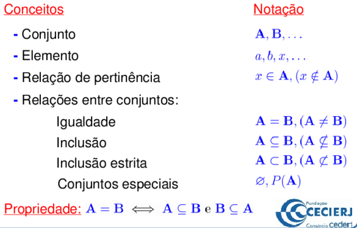

Exercícios:

 { x ∈ | |x| ≤ 4 } onde |a| = a se a ≥ 0 ou |a| = -a se a < 0
 (Observação: |x| ≤ 4 é equivalente a -4 ≤ x ≤ 4 )

(iii) ∅ ∈/ P(A), onde A = {1, 2}
Resposta: FALSA, pois P(A) = {∅, {1}, {2}, {1, 2}} e ∅ é um elemento do conjunto P(A), logo ∅ ∈ P(A).

(iv) {1} ∈ {x ∈ R|x^2 = 1}
Resposta: FALSA, pois {1} não é um elemento do conjunto {x ∈
R|x
2 = 1}, já que este conjunto é formado apenas pelos elementos 1 e −1, temos 1 ∈ {x ∈ R|x^2 = 1} e {1} ⊆ {x ∈ R|x
2 = 1}.

(ii) {π} ⊂ {1, {π}, a}
Resposta: FALSA. De fato, π não é um elemento de {1, {π}, a}. Portanto, a definição de inclusão estrita não é verificada.
(iii) {{π}} ⊂ {1, {π}, a}
Resposta: VERDADEIRA

(iv) ∅´não está contido em  {3, 1, −7}
Resposta: FALSA, pois ∅ ⊆ C, para todo conjunto C

Atentar que quando for relação de pertencimento, estamos fazendo uma comparação de elemento que deve pertencer a algum conjunto. Já o contém é uma relação onde todos os elementos estão contidos em um conjunto. Então comparamos tudo dentro do {} com o outro conjunto. REpare no exercício ii e iii

## Diagramas de Venn

D = { x | x pertence a N e x >= 5} = {5, 6, 7,...}
A = { x | x pertence a N e x^2 = 36} = {6}

Conjunto Universo : Aquele que contém todos os conjuntos de determinado contexto. Denotado pelo U. Todo conjunto está contido no conjunto universo.

A = {x pertence U | P(x)}
Elementos de x pertencem a U tal que x verifica propriedades de partes de x

- O diagrama de Venn é a representação visual de conjuntos, suas operações e relações

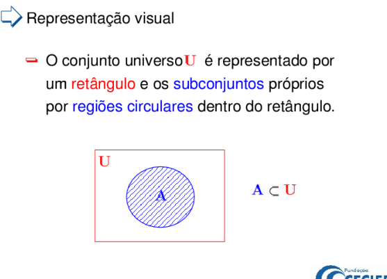

A está contido estritamente em um conjunto universal. 

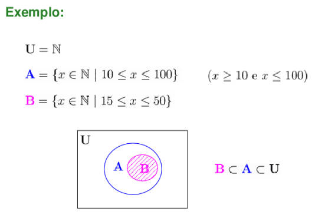

## Operações 

- União :
        Sejam A e B subconjuntos de U, a união de A e B é A U B é o conjunto formado por todos os elementos que pertencem a A ou que pertecem a B
        A = {1, 2, 3, 4, 5, 6}
        B = {5, 6, 7, 8, 9}
        A U B = {1, 2, 3, 4, 5, 6, 7, 8, 9}
        A está contido na união e B também
        Caso o conjunto esteja contido todo no conjunto maior, a união é apenas o conjunto maior
        Propriedade = A está contido em B então A união B é igual a B
        A U B = B -> A está contido em B
        A está contido em B si e somente si A união B = B
        A contido em Universo.A união A = A. A união vazio = A
- Interseção:
        Sejam A e B subconjuntos de U. 
        Interceção de A e B que denotamos A U(invertido) B é o conjunto formado por todos os elementos que pertencem a A e ao conjunto B. A interse B = { x pertence U | x pertence A e x pertence B}
        A = {1, 2, 3, 4, 5, 6}
        B = {5, 6, 7, 8, 9}
        A intersec B = {5, 6}
        Propriedade = A intersec B contido em A e A intersec B contido em B
        Z intersec W = W se W contido em Z. A esta contido em B se e somente se A intersec B = A
        Se A está contido em U temos A intersec A = A e A intersec vazio igual a vazio
- Diferença:
        Sejam A e B subconjuntos de Universo
        A diferença entre A e B ( A - B) é o conjunto formado por todos os elementos que estão em A e não está em B
        A - B = X percente a U | x pertence a A e não pertence a B
        A = {1, 2, 3, 4, 5, 6}
        B = {5, 6, 7, 8, 9}
        A - B = {1, 2, 3, 4}
        Propriedade = A - B contido A e B - A contido C
        z = altura de x >= 1,75
        w = altura de x >= 1,90
        Z - W = Z - W contido em Z -> x >=1,75 e x < 1,90
        W - Z = vazio     A está contido em B se e somente se A - B = vazio
        A - A = vazio
        A - vazio = A
- Complemento:
        Sejam o conjunto universo U e o conjunto A contido em U:
        O complemento de A que denotamos A(com traço em cima) é o conjunto formado por todos os elementos de U que não estão em A. A(traço) = U - A
        U = N
        A = { x pertence N | x <= 50}
        A(traço) = N - A = {x pertence N | x > 50}
        U = Z
        A = { x pertence Z | x > 2}
        A(traço) = {x <=2 } -> 2, 1, 0, -1...

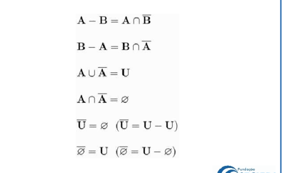
- Comutatividade:
A união B = B união A
A interseção B =  B interseção A

- Associatividade:
(A união B) uniao C = A união (B união C) = A U B U C
(a inter B) inter C = A inter B inter C

- Distributividade:
A união (B intersec C) = (A uniao B) intersec ( A uniao C)

## Leis de Morgan:
Complemento de A U B = U - (A U B)
traço traço (A união B) = traço A intersec traço B .  Colocamos o traço e união vira intersec
A uniao B ( traco) = A(traço) intersec B(traço)

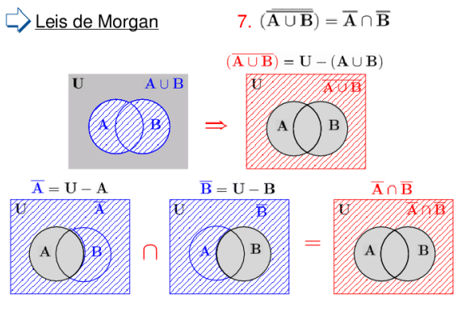

(a intersec b) traço = A(traço) uniao B(traço)

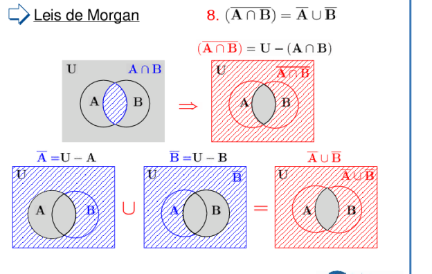

## Prova formal de identidade 5

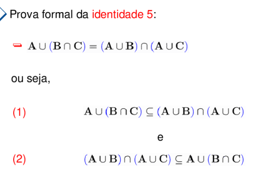

## Resumo

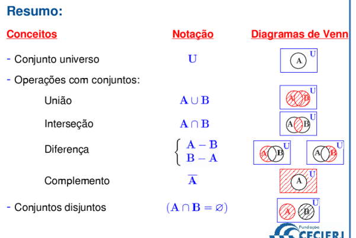
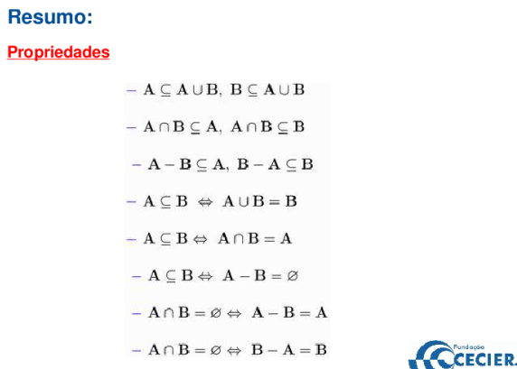
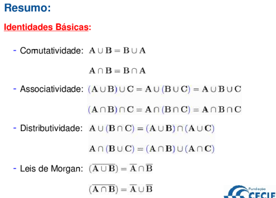
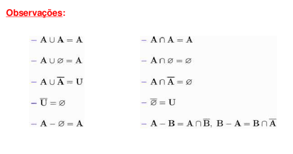

## Números de elementos

n(A) : número de elementos de conjunto de A ( cardinalidade de A)

A = { x pertence Z | |x| <=3} = -3 <= x <= 3
n ( A) = 7

- Podemos ir enumerando os elementos de conjunto mas nem sempre poderemos contar todos os elementos
- Conjunto finito  - Possível de contar números de seus elementos
- Conjunto infinito - Não é possível contar o número de seus elementos

- Apesar de ser finito, alguns conjuntos não são possíveis de serem contados

- Princípio Aditivo:
Se A e B são disjuntos, A intersec B = vazio
então n(A U B) = n(A) + n(B)

- Princípio da inclusão ou exclusão:
Dados conjuntos A e B, calcular n(A U B), mas eles tem intersec diferente de vazio
N(A U B) = n(A - B) + n(A intersec b) + n(B - A)
N(A) = n(A - B) + n(A intersec B)

ou
N(A U B) = n(A) + n(B) - n(A intersec B)

- Princípio inclusão e exclusão para três conjuntos

n(A U B U C)
n(A) + n(B) + n(C) - intersec + n(A intersec B intersec C)

na hora de eliminar interseções eu to eliminando a mais, por isso somo de novo

## Princípio da indução matemática
Técnica para provar resultados matemáticos. Provar resultados que envolvem os números naturais

PIM -> Princípio da indução matemática

Idéia intuitiva -> Se algo vale para o caso base ele vai valer para todos os próximos casos

seja P(n) uma afirmação, para cada n pertencente a N
P(1) verdadeira e
P(k) verdadeira -> P(k + 1) verdadeira
P(n) é verdadeira para todo n pertencente a Naturais

1 - Base da indução:
Mostrar que P(n) verdadeira para n = 1

2 - Hipótese de indução:
Assumir que P(k) verdadeira para k >= 1

3 - Passo indutivo:
Mostrar que P(k + 1) verdadeira assumindo 2

Exemplo:

Soma de números de sequência - n(n + 1) / 2

prova que P(n) = n(n+1)/2

1 - Base da indução:
P(1) = 1(1+1) / 2 = 1 VERDADEIRA

2 - Hipótese de indução (HI) - Assuma que P(k) é verdadeira, k >=1
P(k) = k(k+1) / 2

3 - Passo indutivo - se P(k) é verdadeiro P(k + 1) é verdadeiro. podemos substituir a parte de k com o que vimos na hipótese 2 já que ela é verdadeira

soma de K = k(k + 1) / 2
soma de K + 1 = k(k + 1)/ 2 + k + 1
(k^2 + k)/2 + (k + 1) = 
(k^2 + k + 2k + 2)/ 2
k^2 + 3k + 2 -> 
(k+1)(k+2) / 2 - > n(n+1) / 2
é VERDADEIRO

Então pelo pim P(n) = n(n + 1) / 2 -> verdadeiro

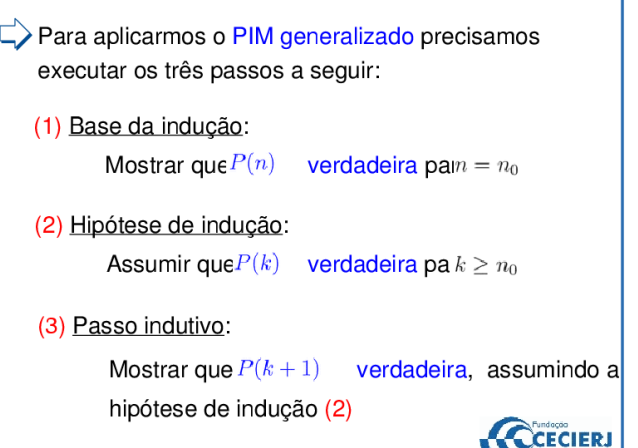
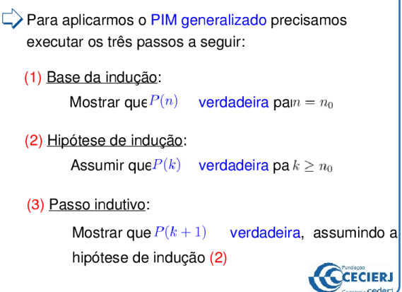

### Aula youtube

A soma dos n primeiros numeros impares = n^2

Base indutiva: O 1º dominó cairá
Passo indutivo : Se um dominó cair então o seguinte também irá cair

Numero impar n = 2n - 1;

1, 3, 5 ... (2n -1) = n^2

Base: 1 = 1^2 OK
Hipótese : Funciona para um determinado valor de n = k;
Tese: Provar se funciona para k funciona para k + 1;

O próximo numero impar é duas unidades maior, 2k + 1

1 + 3 ... 2k - 1 = k^2
1 + 3 ... 2k - 1 + (2k -1 +2) = (k + 1)^2
________________
        ||
        k^2 + 2k + 1 = k^2 + 2k + 1;

### Sequencia de fibonnaci

Fn + F(n +1) = F(n + 2);

## Indução Forte

Sequência de Fibonatti:

Fn n>= 3 é calculado recursivamente...

1, 1, 2, (2 + 1) = 3, (2 + 3) = 5, (5 + 3) = 8, (8 + 5) = 13

 Prova - F1^2 + F2^2 ... + Fn^2 = Fn * Fn+1

 1 - Base indução - n = 1

 F1^2 = 1;  ==> 1 = 1 * f2(1) = 1

 2 - Hipótese indução - julgo verdadeiro para k

 3 -  P(k) é verdadeira, logo P(k + 1)também

f1^2 ... = fk * f k + 1

fk * f(k + 1) + F(k + 1) ^2 = Fk + 1 * Fk + 2
f(k+1)^2 = F(k+1) * F(k + 2) - F(k) * F(k + 1);
f(k+1) ^2 = F(k+1) * (F(k + 2) - F(k));
f(k+1)^2 = F(k+1) * F(k + 1);

F(k + 1) = Fk + F(k+1)

## Principio Aditivo e multiplicativo

- As vezes não queremos saber quais elementos de conjunto temos e sim enumeralos
- Ambos esses princípios podem ser utilizados em diferentes tipos de programas, sendo de Permutação, arranjo, combinação
- Problemas que aparecem em probabilidades, teoria de grafos e análise de algoritmos

Exemplo 1:
- 4 livros Matematica
- 3 livros Portugues

a- um livro de mat ou portugues = 4 maneiras pro de mat e 3 de portugues = 4 + 3 maneiras = 7 maneiras
b - Dois livros, sendo um de mat e um de port = (4 x 3) = 12 maneiras;

OU - Aditivo
E - Multiplicativo

### Principio Aditivo 

- se A e B são conjuntos com interseção vazia, temos A U B = N(A) + N(B)
São eventos mutusmente exclusivos
N(A) = |A|
|A U B | = |A| + |B|

### Principio Multiplicativo

- Se A é conjunto com M elementos e B é conjunto com N elementos, então conjunto |A * B| = |A| x |B|
- De quantas maneiras uma pessoa pode entrar e sair de um predio de 8 portas : 8 para entrar x 8 para sair = 64
- e se ela não puder sair pela mesma porta = São 8 pares a menos que não podem existir. 8 * 8 - 8 = 56

O D é o numero de pares que são excluidos das maneiras, nesse caso P1 e P1, P2 e P2... Dando no total 8 pares que não podem acontecer
|A x A | - |D| ( principio aditivo)
|A| * |A| - |D| ( principio multiplicativo)

### Extensão do princípio aditivo

Se A1, A2 ... An são conjuntos disjuntos dois a dois

Então conjunto possui M1 ... Mn elementos

## Permutações simples e singulares

- Características gerais de permutação: Elementos são distintos, ordem importa seja na posição ou em relação
- Fatorial de Número : O fatorial de numero N, denotado por n!, é o produto dos n primeiros numeros naturais.
- 0! = 1

- Permutação Simples:
        - Elementos são considerados diferentes
        - Cada troca de posição(ordem) dos elementos corresponde a uma possibilidade ( quando a ordem importa o numero é maior do que se não importasse porque quando a ordem não importa eu preciso ainda dividir). Numeros por exemplo importa ordem, objetos distintos
        - Na obtenção do número de possibilidades aplica-se os princípios aditivo e multiplicativo
        - Dado n objetos distintos, uma permutação simples é uma ordenação desses elementos
        Pn = N!

- Permutação Circular:
        - Dados N objetos distintos, uma permutação circular é uma ordenação onde o que importa é a posição relativa dos objetos entre si.
        - quando o que não importa é a ordem e sim a posição entre os elementos
        - Possibilidades / Numero de lugares
        - Podemos fazer a divisão dos números de elementos fatorial por o numero de elementos. 
        Pn = N!/ N ou (N - 1)!

Exemplo:

Uma roda de ciranda 6 crianças : (6 - 1)! = 120 possibilidades
Uma roda de ciranda 6 crianças sem que c1 e c2 não fiquem juntas:
        Quatro crianças = 3! = 6 possibilidades
        Inclusão de C1 = 4 possibilidades
        Inclousão de C2 = 3 possibilidades
        Total = 6 * 4 * 3 = 72 rodas diferentes de modo que C1 e C2 não fiquem juntas

## Arranjos Simples

        - Elementos diferentes, cada escolha de elementos distintos e ordenados ( a ordem importa) são uma possibilidade
        - Utilizamos em casos onde o numero de elementos é diferente do numero de pessoas ou posições
        - Elementos ordenados e distintos tomados de R a R ( posições)
        - A(n, r) = N! / (N - R)!
        - A(n,n) = N! = Pn
        - Exemplo - 1 pessoa, duas portas distintas para entrar e sair, 8 portas - 8 x 9

Exemplo:
Placa de carro 3 letras e 4 digitos
26 * 25 * 24 * 10 * 9 * 8 = usamos o aditivo aqui porque cada letra pode distinta vai referenciar uma placa para cada numero

## Combinações Simples

        - Combinação de ELEMENTOS DISTINTOS tomados R a R, SEM ORDEM, cada escolha R elementos corresponde a uma possibilidade
        - Quando a ordem não é importante
        - As possibilidades são menores do que quando é arranjo
        - A pergunta pode ser mudada para "Quantos conjuntos de N elementos está em A"
        - Podemos fazer a conta do arranjo, que é a combinação de elementos tomado de R em R, mas devemos lembrar de dividir por o numero de permutações entre a tomada Rr, porque as permutações indicam que podem existir subconjuntos iguais. 
        - C(N, R) = N! / R! (N - R)! = A(N, R)/ Pr

## Permutações com Repetição

        - Mesmo numero de elementos para numero de lugares
        - Elementos que não são diferentes, são indistinguíveis, cada troca de posição(ordem) dos elementos dif corresponde a uma possibilidade
        - Elementos que ao trocarmos temos o mesmo subconjunto
        - Primeiro fazemos a permutação entre os elementos totais, sem distinguir igualdade
        - Segundo dividimos as igualdades
        - Quando não sabemos a solução podemos dividir em etapas. Misturar permutação de elementos distintintos e combinação de elmenetos iguais
        - N! / Nrep! x Nrep2!... = Pr

## Arranjos com repetição

        - Os elementos são distintos e a ordem é importante para definir possibilidade.
        - Os elementos podem se repetir na hora de serem tomados R a R
        - N = | A x A x A |
        -  ARn^r = n^r = AR(n, r)
        - Podemos mesclar elementos separados, usamos o principio multiplicativo quando percebemos que para cada escolha teremos x N possibilidades seguintes do grupo dos outros elementos. Utilizamos a adição quando notamos que podemos escolher uma coisa ou outra coisa.

## Representação Decimal Numeros

30,25 -> 3 x 10^1 + 0 x 10^0 + 2*10^-1 + 5 * 10^-2

## Combinação com Repetições

        - Podemos resolver alguns desses problemas com permutação com repetição, caso os elementos e espaços sejam iguais
        - Se os elementos e espaços não forem iguais usamos combinação com repetição.
        - Podemos pensar que é como uma permutação onde deixamos alguns numeros parados e movemos os outros
        - Quando temos valores onde a ordem importa podemos usar 1 e sem ordem 0
        - N objetos diferentes
        - Entre N objetos dados escolhem-se R que podem ser repetidos
        - Associamos o objeto distinto a 1 e o que pode ser repetido a 0
        - N objetos diferentes, combinação de objetos N tomados R a R é uma seleção de objetos distintos ou não escolhidos entre objetos dados
        - CRn^r = C(N + R - 1, n -  1);
        
## Coeficientes binomiais

Chamamos de C(n, r) de coeficiente binomial. Ou seja, a combinação de N em r a r temos um coeficiente binomial.

n! / r! (n-r)!

- Numero de possibilidade de escolher de possibilidades de escolher r objetos difernetes entre n objetos diferentes = expresão algébrica

- Argumento combinatório e algebrico: Dois tipos de argumentos que pode ser usados na dedução de teoremas e identidades envolvendo fatoriais ou coeficientes binomiais. 
- O Raciocínio combinatório está baseado na decomposição de um conjunto em subconjuntos adequados e na contagem de elementos que aparecem as combinações simples
- O raciocínio algébrico está baseado na manipulação de fatoriais

- Um racicionio combinatório determina a forma de uma expressão algébrica e vice versa. Uma forma de expressão algébrica sugere um raciocínio combinatório. 

Raciocinios combinatorios equivalentes geram identidades algébricas e vice-versa

### Identidades

- C(n, r) = C(n, n - r)

n!/r!(n -r)! = n! / (n - r)! (n - (n - r))!

- Relação de Stiff : 
C(n, r) + C(n, r + 1) = C(n + 1, r + 1)

Seja um grupo (conjunto) formado por n + 1 elementos, onde n são do mesmo tipo e 1 é de outro tipo (por exemplo, n homens, 1 mulher). 

As diferentes maneiras de selecionar nesse grupo um subgrupo de r + 1 elementos (por exemplo, r + 1 pessoas entre os n homens e 1 mulher) podem
ser decompostos em 2 classes disjuntas:
- os que têm r do mesmo tipo e 1 do outro tipo
(por exemplo, r homens e 1 mulher)

- os que têm r + 1 do mesmo tipo

(por exemplo, r + 1 homens)

Prova:

Selecionar grupo de r + 1 elementos em n + 1 é igual a :

C(n + 1, r + 1) =

Selecionar r (tipos diferentes) elementos em n

C(n, r)

Selectionar r + 1(mesmo tipos)

C(n, r + 1)

*Relação de Stifel*

C(n + 1, r + 1) = C(n, r) + C(n, r + 1) n = 1, 2, ...

r = 0, 1, ... , n−1

é equivalente a:

C(n, r) = C(n - 1, r -1) + C(n - 1, r)

- Condição de fronteira
C(n, 0) = C(n, n) = 1

- Condição secundárias

C(n, 1) = C(n, n − 1) = n

## Triangulo de PASCAL

Podemos usar relação de stiffel, condição de fronteira e condição secundária no triangulo de Pascal e analisar as combinações

1
1 1
1 2 1
1 3 3 1
1 4 6 4 1
1 5 10 10 5 1
...

As fronteiras são sempre quando temos o numero fazendo combinação de 0 elementos ou de N elementos. Sempre dará um.

As  secundárias são vistas quando N elementos são tomados por 1 ou por N - 1 elementos

A relação de stifel é vista nas diagonais a partir da terceira linha, onde temos 3 + 3 = 6. Combinação deste elemento N tomado R a R é a soma da combinação de N - 1 elementos tomados R - 1 a R - 1 mais combinação de N - 1 elementos tomado a R. Então é o de cima somado com o da diagonal do lado esquerdo ao de cima. 

- Teorema das linhas : Pelo teorema das linhas conseguimos calcular a soma dos elementos de uma linha n sem a necessidade de conhecer os elementos. 

A soam dos elementos é 2 ^n.

- Teorema das colunas:

dividimos entre linhas N e colunas R; A soma das colunas r é a resposta para o elemento da proxima linha na diagonal seguinte. 

C (r, r) + C(r + 1, r) ... C(n, r) = C(n +1, r + 1).

- Teorema das diagonais:

C (n + r + 1, r) = C(n, 0) + C(n + 1, 1)... C(n + r, r)

RESUMO:

Definição:
Coeficiente binomial: C(n, r) = 
        n !
_________________
    r! (n − r)!

Argumentos:
Na dedução de propriedades envolvendo coeficientes binomiais

• combinatórios • algébricos

Observação:
Raciocínios combinatórios equivalentes geram identidades algébricas e vice-versa.

## Binômios de Newton

Chamamos de binômio qualquer expressão da forma a+b onde a e b são simbolos diferentes.

ex: 
x - y = x + (-y)
3xy + x^2

(a + b)^0 = 1
(a+ b)^1 = a + b
(a + b)^2 = a ^2 + 2ab + b ^2 

Note que cada coeficiente demonstra a linha na piramide de pascal. Logo, temos que a linha pode ser representada pelo binômio elevado a N(num da linha)

Principio de indução matemática:

seja P(n) : (a + b)^n = Soma de r=0 até n C(n, r) A^n - r B^r

Base de indução:

(a + b) ^1 = a + b

a + b = C(1, 0)a^1 + C(1, 1)b^1

Logo P(1) é verdadeira

Hipótese : 
P(k) é verdadeira

Prova:
Se P(k) é verdadeira -> P(k + 1) também

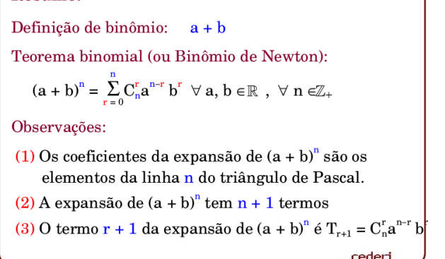

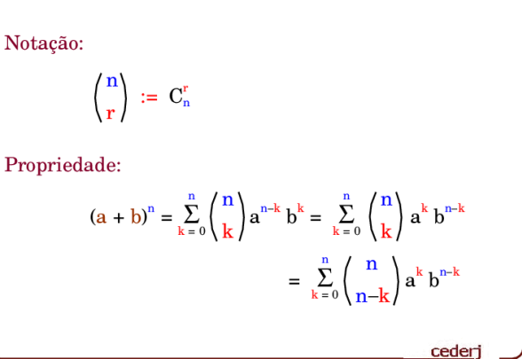

TEOREMA BINOMIAL:

(a+b)^n = Ec=0 ^n C(n, r)a ^n-r b^r

A Expansão binomial: - Sempre tem n + 1 termos

(x+3)^4 = x e 3 - > C(4, 0) x^4 + C(4,1) x^3 3^1 + C(4, 2) x^2 3^2 + C(4, 3) x 3^3 + C(4, 4) 3^4

 1 *1x^4 + 4*3*x^3 +6 *9x^2 + 4*27x + 81

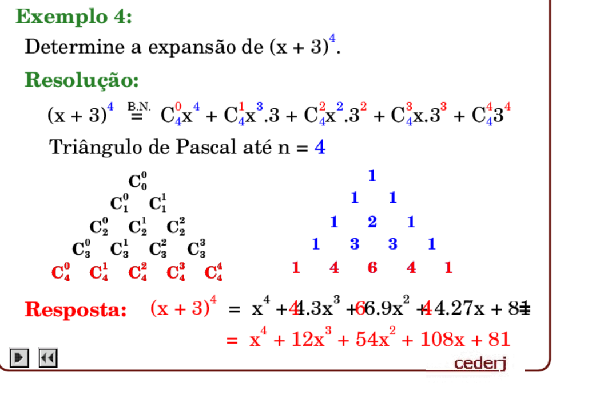

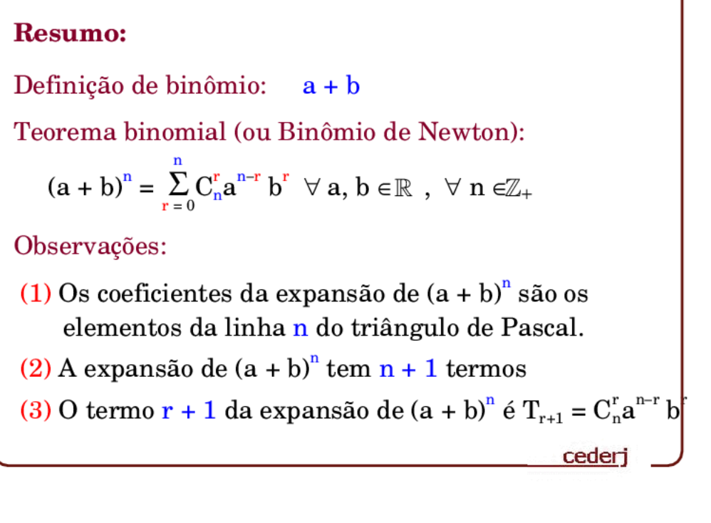

## Relações de Recorrencia

Apresentar técnica recursiva que permite reduzir problema envolvendo n objetos a outro problema com n -1 objetos.... n -2 ...

- Uma relação de recorrencia é uma formula que relaciona um numero a a alguns de seus predecedores

- Finonacci : Fn-1 + Fn -2

- Propriedade Tn = 2^n  - 1 -> torre de hanoi, Método de Substituição só funciona para algumas relações de recorrencia

## Grafos

- Problemas reais podem ser modelados por grafos
- São estruturas matemáticas discretas e tem interesse prático e teórico

- Ideia inicial : Problema da ponte de kalinberg, atravessar pontes de diferentes pontos. Devemos determinar o trajeto que ocorre a partir de um ponto, percorrer tudo e voltar ao ponto de origem sem repetir vertices

### Definições Básicas

- Um grafo simples, ou grafo G é um par (V, E) denotado por G = (V, E). Onde V é conjunto finito não vazio de elementos denominados vértices e E é um conjunto de pares não ordenados de elementos distintos chamados arestas
        - grafos = grafos simples
        - vertices = nós = pontos
        - numero de vertices de G = |V(G)| = n
        - numero de arestas de G : |E(G)| = m
        - conjunto de vértices e arestas : V(G1), E(G1)

- Dado um grafo G = (V, E). Cada aresta e pertencente a E será detonado pelo par e = (v, w)

- V = {a, b, c, d, e}
- E - {(a,b)(b,c)(a,c)(a,e)(e, d), (c, d)}

- A representação não é unica, depende de como posicionamos os vertices

- Se relaxamos a definição de grafos, de maneira que admitamos a existencia de pares não ordenados iguais de elementos distintos V, chamdas arestas paralelas e de pares não ordenados de elementos iguais, chamados laços, temos então um multigrafo:
        - V = {a, b, c, d}
        - E = {(a, b), (a, b), (b,c),(c,d), (d, a), (c, c)}

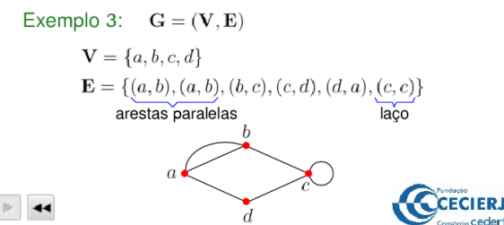

- vértices v e w são adjacentes/vizinho se (v, w) pertence a E. Se existe uma aresta entre eles
        - N(a) = {b, c, e} - vizinhos
- Vertice v é isolado se N(v) =vazio, ou seja é isolado
- Um vértice de G é dito universal quando N(b) = V - {v} -  é vizinho de todos menos dele

- Em um mesmo grafo não podemos ter ao mesmo tempo um vértice isolado e um universal

- Complemento  de um grafo G, denotado por G(com linha) é o grafo que tem o mesmo conjunto de vértices de G e tal que dois vértices distintos são adjacentes em G se e somente se não são adjacentes em G. Ou seja, é tudo invertido. Se são adjacentes em G, não serão em complomento de G, mas com mesmo conjunto de vértices

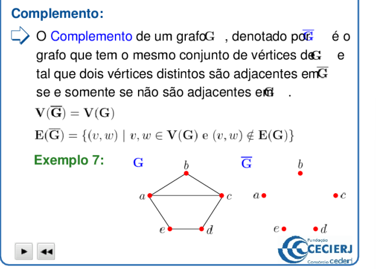

- Sejam os grafos G e H, H é dito subgrafo de G se V(H) contido em V(G) e E(G) contido em E(G)

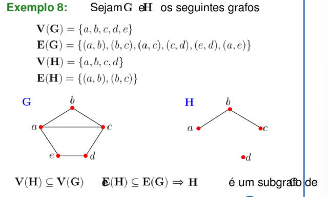

- subgrafo induzido pegamos os vértices do de indução, verificamos se está contido no V(G), e depois montamos a Arestas com as arestas disponiveis no E(G) que tenham os vertices disponiveis no de indução. Ele preserva a estrutura original.

- subgrafo gerador : H é dito subgrafo gerador de G se H é subgrafo de G. V(H) = V(G)

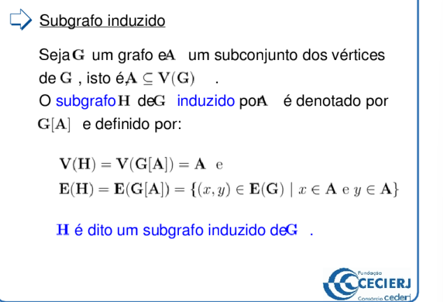

- Grafo completo : Todos os seus pares de vertices distintos são adjacentes. Todos os vértices são universais. Com n vertices representamos ele com Kn

- Seja G um grafo e A um subconjunto de vertices de G, A é uma clique de G se G[A] é grafo completo. Ou seja, o grafo induzido por eles é um grafo completo

- Grafo Nulo: é nulo, ou completamente independente se todos os seus pares de vértices distintos não são adjacentes. Todos seus vértices são isolados. Um grafo nulo com n vértices é denotado por Nn.

- Conjunto independente : Seja um grafo e S um subconjunto de vértices de G, S é conjunto independente de G se G[S] é grafo nulo

## Grau de um vértice

