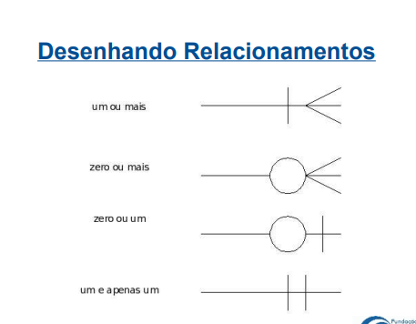

# Modelagem - UFF - Terceiro período

## O que é modelo:

Modelo é representação abstrata de sistema. Permite explicar, testar, analisar, resolver problemas
no sistema real.

## Sistemas

Sistema são composições de objetos, ações, pessoas...

## Modelo de Informação

Representação abstrata da informação em um sistema, mas sistemas de computação também são bastante abstratos

- Facilita a comunicação
- Desenvolve compreensão
- Descreve diferentes perspectivas
- Define, especificando e limitando a info tratada
- Permite a verificação e validação

## Verificar  X Validar
- Verificar - Confirmar a correção de modelo em relação a outro ou si mesmo
- Validar - Confirmar a correção de modelo em relação ao mundo

## Métodos de modelagem:
- OO - UML
- Entidades e Relacionamentos
- Relacional

## Técnica Geral:
- Observação dos objetos
- Entendimento dos conceitos ( identificar, conceituar, entender, assimilar)
- Representação dos objetos
- Verificação da fidelidade e coerência
- Validação do modelo

## Niveis de Abstração
- Conceitual : Representa o ambiente observado, independente da tecnologia, não está sujeito a suas limitações. Ideal para entendimento. Estável a longo prazo. Ou desenhado com Identidade relacionamento ou OO.
- Lógico : Adota uma tecnologia, não adota um produto ou dispositivo. Modelo relacional ou OO.
- Modelo físico : Exige conhecimento físico de estrutura de dados. Representa dados na aplicação. Totalmente dependente da solução adotada. Tipicamento metodo relacional de SGDB e modelo OO

## Abstração
Processo mental de separar um ou mais elementos de uma totalidade complexa de forma a facilitar a compreensão. Menos detalhes e seleção de detalhes específicos

Algo pode ser considerado abstrato se não existe em nenhum lugar ou tempo, o que existe são suas instâncias

estratégia:
- eliminar detalhes, deixar eles vagos, indefinidos, ambíguos

O mesmo objeto pode ser abstraído de formas diferentes, elas formam modelos

Objetivos:
- Eliminar detalhes que aumentam a complexidade inultimente
- Utilizar detalhes que facilitam a compreensão
- Escolher a forma mais interessante de mostrar os detalhes

## Tipos Básicos de Abstração

### Classificação
Passamos a considerar objetos membros de uma classe. Pensamos que é membro de , é do tipo de. Eliminamos a individualidade. Passamos a considerar o objeto como membro de uma classe. Criamos uma ideia abstrata que descreve todos objetos desta classe

- A forma de reverter a classificação é a instanciação. PRocesso de reversão. Escolhe elemento de classe, é uma individualização. 

### Agregação ou Composição
Entendemos o todo como a composição de uma classe. Entendemos um objeto formado por conjunto de outros objetos como um só objeto. 

### Generalização:
Nós somos capazes de entender como uma classe pode ser descrita por outra classe mais geral. O processo reverso da generalização é especialização

- Classificação : objetos formam classes
- Generalização : classes são outras classes mais bem detalhadas(especificadas
)

Com a generalização podemos compreender relação muito comum entre classes que é a que permite que qualquer objeto de classe possa ser visto. Utilizando a generalização podemos simplificar a forma de tratar objetos de classes similares

### Identificação
Com a identificação nós somos capazes de entender como caracterizar unicamente um objeto. O nome identifica uma pessoa. 
Ao identificar unicamente objeto podemos separá-lo de outro objeto semelhante e atribuir a entidades específicas, atributos e características que só pertencem a ela e não pertencem a outros elementos daquela classe

### Istancia X identidade:

Uma instância deve possuir uma identificação e uma identificação se aplica a uma instância. A identificação permite que duas instâncias sejam reconhecidas como distintas ou como representações de um mesmo objeto

## 5W2H:
Acrônimo para conjunto de palavras em inglês

What, Who, When, Where, Why, How, How Much

- Ao tentar resolver situação você responde essas perguntas. 
- Cada resposta deve ser clara, ou não ser necessária e precisar ser melhor esclarecida

Ao definir uma entidade:
O que ela é? Quem é o responsável por ela? Quem pediu, quem indicou? Quando deve ser utilizada, Em que sistema sera utilizada? Por que ela é necessária?

## Modelo de Entidades Relacionamento - MER

- Modelo gráfico que descreve o mundo como um mundo cheio de coisas com características próprias que se relacionam entre si

- Diagrama de Entidades e Relacionamentos

- Existem diferentes formas de representação, todos herdeiros do modelo de entidades e relacionamentos

O original:
Entidades - retângulos
Relacionamentos - Losangos
Atributos - Círculos

Modelo de engenharia de informação:
Entidades são retângulos
Atributos são listados no retângulo
Relacionamentos são apenas linhas com símbolos que lembram pés de galinha

Modelo IDEF1X
Entidades são retângulos, atributos listados no retângulo, Relacionamentos são apenas linhas com bolas pretas nas pontas

Neste curso - Modelo de engenharia de informação

### Definir Modelo Entidade Relacionamento
Modelo descreve o mundo cheio de coisas...

Entidades = Coisas

Cada coisa modelada deve poder ser identificada unicamente, ou seja devemos ser capazes de identificar instâncias dessas coisas

Uma entidade é uma pessoa, objeto, local, animal, acontecimento,
organização ou outra idéia abstrata sobre a qual o sistema deve
se lembrar alguma coisa

Uma entidade é uma classe de objetos -> Abstração de classificação

Uma entidade é um conjunto não vazio de objetos. A entidade deve ser de interesse para o sistema sendo modelado.

Cada instância de uma determinada entidade tem características
similares (mas não iguais), o mesmo comportamento e uma
identidade própria.

Entidades não possuem valor, elas tem características que possuem valores

### Diagramando Entidades

- Dentro de retângulos vão as entidades
- As características são os atributos dessa entidade. Atributos = Características que toda instância possui, mas que variam
de valor entre uma instância e outra. Algumas características podem ser opcionais ou obrigatórias. Atributo possui valor. Devemos escolher os atributos que são necessários e suficientes para aquele sistema apenas, e eliminamos detalhes não importantes.
- Domínio é o tipo de determinado atributo. Pode ser Números, Strings, Data/Hora, Lógicos, Lista de Valores, Valores com Regras e identificadores( CPF, CNPJ)

## Relacionamentos:

Um modelo que descreve o mundo como
"...cheio de coisas que possuem características próprias
e que se relacionam entre si"
"...Entidades que possuem atributos e que se relacionam
entre si"
se relacionam entre si = relacionamentos

- Relacionamentos são representados por linhas com símbolos no início e fim para indicar cardinalidade

Uma entidade representa um conjunto de elementos de uma mesma classe. Quando duas entidades se relacionam, podemos definir uma relação, no sentido matemático do termo, entre os dois conjuntos.

- Um relacionamento entre duas Entidades indica que as instâncias de uma Entidade podem se relacionar, uma certa quantidade de vezes, com instâncias da outra entidade

- Quantas vezes as instâncias podem se relacionar. A resposta é modelada na Cardinalidade do relacionamento

### Cardinalidades Simples

- 1 x 1 : Cada instância de uma entidade só pode se relacionar com uma instância de outra entidade. Como casamento, Caminhão usando reboque. Um homem só pode casar com uma mulher ex.
- 1 x N : Cada instância de entidades pode se relacionar com várias instâncias da outra entidade, mas essas só podem se relacionar com uma primeira. Ex: Mãe deu a luz ao filho, ela pode ter vários. Mas o filho só tem uma mãe.
- N x M : Quando são possíveis multiplos relacionamentos dos dois lados. Ex : Ator e filme, Ator faz vários filmes. Vários filmes atuados pelo mesmo ator.

Para detalhar melhor os relacionamentos, falamos de Cardinalidade Máxima e mínima:
- A cardinalidade mínima é sempre 0 ou 1, e determina obrigatoriedade. Ficamos sabendo se o relacionamento é obrigatório ou opcional. Isso é se cada instância deve ter ou não um relacionamento com instâncias da outra entidade.
- A cardinalidade máxima é sempre 1 ou N

 

Uma pessoa possui 0 ou N Apartamentos. Já um apartamento é possuído por 1 ou N pessoas. 

## Ferramentas para modelos MER

- Erwin
- DbDesigner
- Dia
- Visio

Utilizamos Linhas retas para mostrar que um item obrigatoriamente esta no outro. A linha pontilhada indica que o
relacionamento não é identificador
Não há dependência.

Usamos retângulo para representar entidade que não depende do outro. Agora usamos retangulo arredondado para representar um que é dependente do outro

- No ERWin, não é possível indicar a
cardinalidade mínima em relacionamentos NxM. 

## Herança

- Entidades são classes de objetos, possuem características descritas por atributos, possuem valores de um domínio(tipo), se relacionam, devem ser definidos um número mínimo e máximo de relacionamento entre as entidades. Colocamos o relacionamento quando ele deseja ficar no histórico.

- Generalização : Uma classe pode ser descrita por outra classe mais geral

- O processo reverso da generalização é a especialização

### Tipos de Herança

Quanto a totalidade da cobertura:
- Total: As instâncias que pertencem a entidade mais geral
pertencem a pelo menos uma das entidade mais específicas
- Parcial : Pertence a classe mais geral, já o da total não necessariamente pertence a da específica

Quanto a exclusividade da cobertura:
- Exclusiva : Se uma instância pertence a uma entidade mais específica ela não pertence a outra
- Sobreposta : Uma instância pode pertencer a várias entidades específicas sob uma entidade mais geral. Como alunos de universidades que podem ser da pós graduação, extensão

- A Herança sobreposta deve ser evitada
- Deve ser substituída por entidades que representem
os papéis associados
- Devemos privilegiar as heranças totais e exclusivas

Como caracterizar herança:

## Como construir o modelo:

Lembrando da Técnica Geral com Modelos: 
- Observação dos objetos
- Entendimento dos conceitos
- Identificar
- Conceituar
- Entender
- Assimilar
- Representação dos objetos
- Verificação da fidelidade e coerência
- Validação do Modelo

Como achar entidades: 
No discurso fluente durante uma entrevista, entidades são geralmente substantivos ocupando o papel de sujeito ou objeto:
- Os funcionários recebem salário

Os tipos básicos são : objetos tangíveis, papéis exercidos, eventos, interações, especificações.

### Objetos tangíveis
Podemos tocar, representam objetos que existem no mundo real

## Papéis exercidos
Objetos que podem assumir funções diferentes, papéis diferentes, tipo funcionário, aluno, professor

### Interações e Eventos
Marcam a interação entre dois ou mais objetos, e são requeridas para visualizar histórico por exemplo. Como Matricula, venda, casamento. Elas implicam em observar o tempo. As linhas que saem dela são sempre inteiras porque elas possuem relacionamento identificador com as outras entidades.
- Acontece em um período de tempo
- Exigem guardar data, hora, duração
- Reunião, Aula
- é identificada por linha inteira e fica em caixinha arredondada porque depende das entidades para identificação

### Especificações
São entidades que servem para classificar outras entidades, elas servem para substituir um atributo que rotula a classe controlando possíveis valores. 
- Por exemplo, temos aluno e uma especificação dele Tipo de aluno para termos os descontos e motivos

Todas as entidades devem ter papel único e definido no negócio, se não lembramos não precisamos explica-la. Entidades devem ter ao menos um atributo, devem ter mais de uma instância, não possuem valores apenas atributos tem valores, e devem possuir instâncias unicamente identificáveis

## Descrevendo Entidades
- Nome (sinonimos e homonimos)
- Definição
- Exemplos
- Atributos
- Relacionamentos
- Correlação
- Regras e exceções relacionadas a ela
- Comentários e observações

## Definir uma entidade

Perguntas 5W2H:
- O que ela é?
- Quando deve ser utilizada?
- Quem é o responsável por ela?
- Em que parte do sistema será utilizada?
- Por que ela é necessária?
- Como ela é? (como será implementada, quais seus atributos?)
- Quanto espaço ela ocupará (fator de custo)?
- Quem pediu, quem indicou, quem usa?

## Atributos
Todo atributo descreve de alguma forma a instância da entidade
Atributos podem ser nominativos ou referenciais

- Descrição
- Domínio os valores válidos
- Tipos de nulos aceitos
- Exemplos

## Relacionamentos
Rede de relacionamentos entre as entidades. Aparecem quando uma entidade se refere a outra. Os relacionamentos aparecem nos verbos, alunos assiste aula, maquina fabrica produto.

- Alunos também servem para identificar entidades, nesse caso a entidade é arredondada e a linha é continua.

- O nome escolhido para o relacionamento pode estar na voz ativa (mãe gera filho) ou na voz passiva (filho é gerado por mãe). Algumas notações permitem que se usem os dois nomes(um por cima e um por baixo da linha de relacionamento). Geralmente se usa o nome que permite a leitura do relacionamento da esquerda para a direta na parte de cima da linha (ou se dá preferência a esse nome quando apenas um pode ser utilizado). As linhas tracejadas indicam que a unidade não é identificada por seu proprietário ou seu inquilino

- Atributos e relacionamentos permitem criar uma identidade única para as entidads. O somatório de todos os atributos e relacionamentos será a identificação da entidade. Se todos os valores de atributos e relacionamentos forem iguais, as entidades são as mesmas

## Identificadores

- Conjuntos de atributos e relacionamentos que identifica unicamente a identidade.

Vários identificadores:
- Chaves candidatas ( na nomenclatura relacional)

Um identificador:
- Chave primária

EScolhemos o mais significativo no modelo. 

No exemplo abaixo ou a entidade é identificada por identificador, neste caso a linha é tracejada e são retangulos. Ou a entidade é identificada pelo identificador e também por sua especificação. Neste caso a entidade é um retangulo arredondado e a linha é reta

Relacionamento identificador - linha inteira.
Relacionamento não identificador - linha tracejada
Entidade que depende da existencia de outra pra existir - arredondada
Entidade que não depende - quadrada
## Manipulando o modelo
- Operações Top-down : Partem do mais geral para mais específico
- Operações Bottom-up : Mais específico para geral

## Modelo top down:
- Dividir entidade em entidade e relacionamento, transforma atributo em entidade, criar sub entidades, dividir entidade, dividir relacionamento, criar entidade em relacionamento, criar atributo

## Modelo Bottom up
Criar entidade, Unir atributos em entidades, hierarquizar entidades, criar relacionamentos entre entidades

## Exercício

- Uma entidade é uma pessoa, objeto, local, animal, acontecimento, organização, ou outra idéia abstrata
sobre a qual o sistema deve se lembrar alguma coisa
- Elas podem ser objetos tangíveis, papéis exercidos, eventos, interações e especificações
- Entidades não possuem valores, são conseitos completos. Os atributos não são conceitos completos e possuem valor

## Modelo Relacional

- Um banco de dados relacional é composto de tabelas. Cada tabela é uma relação, igual na teoria dos conjuntos

- Tabela é conjunto não ordenada de linhas. As linhas também são chamadas de tuplas. Cada linha é composta por uma série de campo
- A primeira linha é o nome dos atributos
- Valores dos Campos devem ser Atômicos - Não podem ser divididos, por exemplo endereço. Se precisar ser vai em outros campos
- Monovalorados - Só possuem um valor

Linguagens de Consulta:
- Como o SQL

SELECT * FROM FILME WHERE ANO=2023

- DOMÍNIO: É conjunto de valores atômicos, significa indivisível. São normalmente especificados definindo o tipo de dados que define os possíveis valores dos dados. Exemplo, nome de pessoas, datas, numeros de telefones mundiais...
        - Nome
        - tipos de dados
        - Formato
        - Outras informações que auxiliam a interpretação

        Exemplo 
        - Nome : Sexo
        - tipo: { F e M}
        - Formato : Letra isolada

- FORMATO: Normalmente especificamos um formato para Domínio. 

- ESQUEMAs de RELAÇÃO: Definido como R(A1, A2... An)
        - Um nome de relação R
        - Uma lista definida de atributos
        - O grau da relação é a quantidade de atributos que a relação descreve

        Exemplo:
        - Filme(CodigoFilme, NomeOriginal, Ano, Tipo)
        - Cliente(Nome, CPF, Telefone, Endereço, Sexo)

- Estado Corrente : Esquema da relação define os valores possíveis para os atributos das tuplas. Relação é conjunto de tuplas válido para algum momento

PESSOA = (NomePessoa, DataNascimentoPessoa)
Dominio(NomePessoa) = Nomes
Dominio(DataNascimentoPessoa) = Datas
r(PESSOA) = {<Abel, 2/7/1996>, <Maria, 10/11/1999>}

- Para interpretar Relação
        - Cada linha de relação é interpretada como uma afirmação
        - É um retrato da realidade em algum momento

### Identificação de Linhas
- A identidade de cada linha de uma tabela é definida pelos valores dos campos
- Não existem no modelo relacional duas linhas onde todos os campos tenham o mesmo valor. Se não elas teriam a mesma identidade e quebraria regra de implementações de SGDB

- chave : Uma chave é conjunto de campos cujos valores identificam unicamente uma linha em uma tabela
        - chave candidata : coluna ou conjunto de colunas que pode ser usado para diferenciar uma linha de todas as outras de uma tabela. Ela pode ser o somatório de todas as linhas
        - Chave primária : coluna ou combinação de colunas escolhido como referencia em uma tabela para diferenciar uma linha das demais. é escolhida entre as chaves candidadtas. Escolha obrigatória e essencial. Serão usadas como chaves estrangeiras em outra tabela
        - chaves alternativas são as candidatas que não foram escolhidas como primarias
        - chave estrangeira : coluna ou conjunto de uma tabela que são chave primaria em alguma tabela. Elas são as primárias em outra tabela

- Restrições de integridade: chaves definem a restrição de integriadde. Unicidade da chave primária por exemplo. Temos integridade de domínio, vazio, tipo, chave e referencial
        - pela chave : na inclusao e alteracao de uma linha na tabela que contem a chave estrangeira. Deve ser garantido que o valor da chave estrangeira seja o mesmo de chave primeira em outra tabela

## Esquema de BD Relacional

- Onde junto todos os esquemas de determinado campo
- Instancia : Cada tabela . Uma chave estrangeira pode referencias a própria tabela

- Algebra Relacional :
        - Modelo relacional : modelo de tabelas
        - Dominio : conjunto de valores
        - tupla - linha
        - atributo - coluna
        - chave - identificador

Algebra relacional é um conjunto de operadores que permitem a partir de tabelas obter tabelas de desejada

        - Union ou U-> Uniao entre tabelas. Não aparecem valores repetidos
        - Intersect ou U(invertido) -> Interseção, aparece apenas os que estão nos dois
        - Minus ou diferença (-) -> Coloca apenas os que estão na A e não na B
        - A TIMES B -> Junta tabelas

- Seleção : Seleciono em uma tabela
- Join : Junção de bancos

## Modelagem OO em UML

- OO surgiu como tentativa de solucionar problemas de desenvolvimento de software. Simplificar abstração e alterações no sistema

- Organizar mundo real como coleção de objetos

- Objetos do mundo real, onde iremos mapear o objeto em abstrações no mundo computacional. Objetos que tenham significado no mundo real 
- Abstração : Operação mental para observar um domínio e capturar estrutura
- Representação : convenções de representação

- Todo modelo é uma abstração de algo que existe ou se imagina no mundo real . UMA REPRESENTAÇÃO

- UML : Reuniu populares técnicas, linguagem para especificação de grandes sistemas, representação uniforme e gradual do conhecimento sobre o sistema

- Um objeto encapsula numa mesma entidade estado e comportamento. Ou seja, atributos e metodos. É um conceito e abstração. Eles possuem identidade, estado e comportamento
        - Podem ser coisas tangíveis, Incidentes e enveots ou até uma Interação
        - Estado de objeto é condição em que o objeto pode existir : é representado pelos valores das suas propriedades em determinado instante
- a classe por si só não tem valores e sim só suas instancias
- herança : Uma classe genérica e suas herdeiras
- Interface : Como objetos se comportam e seus atributos são estão classes na classes interpretadas

Representação de uma classe

NomedaClasse
_____________
atributos
________________
cidade

## Relacionamentos:

- Usamos relacionamentos como os objetos e classes estão conectados no modelo
        - Associação simples : Conexão bidirecional entre duas classes. Pais associado a cidade que é sua capital. Cada um com um papel específico, esse papel deve estar explicito no modelo. 

        Pais ---capital-------- Cidade
        0..1(capital é capital ou nao)                    1(pais sempre tem uma capital) sempre é o conjunto de numeros, numero fixo ou de 0 ... n
        - Agregação e composição : Exemplo de composição 
        losango na ponta. Cidade possui bairro. Cidade possui um ou n bairros. Bairro está em uma e apenas uma cidade
        - herança : Classe mais geral e classes especializadas. A classe herda propriedades e comportamento da mãe. Pode possuir atributos e comportamentos diferentes. Normalmente tem um triangulo ligando a mae e os filhos

## Regras de Negócio

