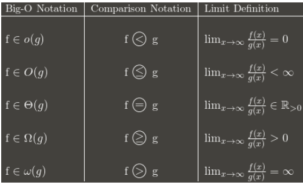
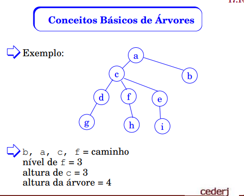
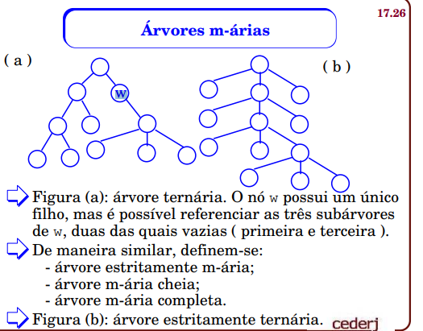
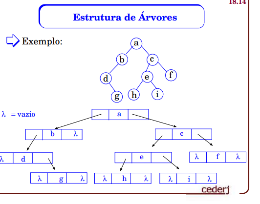
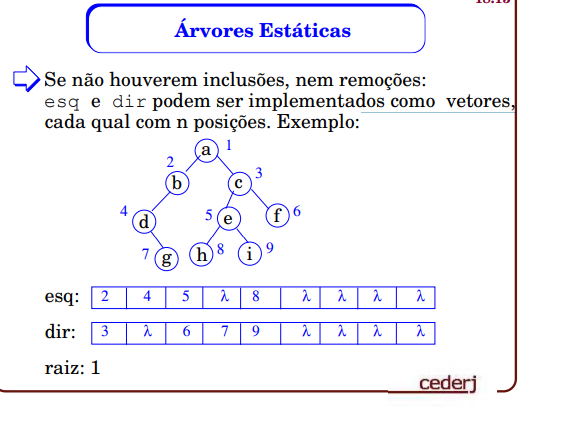

# Estrutura de dados UFF

## O conceito de Algoritmo

Processo sistemático de resolver problemas. 
Entrada -> Algoritmo -> Saída

## Linguagem Utilizada

Linguagem tipo pascal. Linguagem identada em blocos.

Variáveis:
i, j

Vetores:
x[i] 
x[5] - > quinto elemento

Matrizes:
x[i, j]

Ponteiro:
 ↑
ex: pt ↑.info -> o campo info de registro alocado no endereço contido em pt

Procedimentos:
Um procedimento é chamado através da ref a seu nome.
ex:
A

proc A

Funções:
é chamada através da ref a seu nome. Ela retorna valor

função A(B)
ex:
A(B)

Comentários:
Sentença iniciada por %

Atribuição:
:=

Condicionais:
Se A então B

ex:
se x>y então
        x:=[y]
senão
        x:= a + i

Iteração:
Enquanto A faça B ( while)
ou
para A faça B ( for)
repetir ( do while)
até que

ex:
enquanto i != 0 faça
        x := a[i, j]
        i := i - 1

para i = 1, 2 ... n faça
        j := 3a - i

repetir
listar x[i, j]
        i := i - a
        j := j + 1
até que i < j

Declaração Parada:
pare

exemplo:
se i < 0 então pare

Piso de x [x] representa o maior inteiro <= x

Teto de x [x] representa o menor inteiro >=x

ex:
piso de [3,2] é 3
teto de [3,2] é 4

Propriedade: piso n/2 +  teto n/2 = n


Inversão Sequências:

para i = 1 até piso de n/2 faça
        temp := s[i]
        s[i] := s[n - i  + 1]
        s[n - i + 1] := temp


## Recursividade
Procedimentos e funções que chamam a si mesmo. Procedimentos são rotinas e funções são procedimentos que retornam algo. Todo procedimento recursivo ou não deve possuir pelo menos uma chamada não recursiva.

função fat(i)
fat := se i <= 1 então 1
senão i * fat(i - 1)

não recursivo:

fat[0] := 1
para j := 1 ... n faça
        fat[j] := j * fat[j - 1]

## Complexidade de Algoritmos

Objetivo dos métodos é determinar expressão matemática que traduza o comportamento de tempo de algoritmo. Independe do computador, linguagem e depende apenas da qualidade de seu algoritmo.

- quantidade de dados grande, a quantidade reduzida não será considerada. 
- Considerar apenas valores assintóticos, ou seja, a expressão fornecerá valores de tempo que serão validos unicamente quando a quantidade de dados correspondente crescer o suficiente. 
- Não serão consideradas constantes aditivas ou multiplicativas. 
- Variável independente da expressão aritmética : Entrada do Algoritmo N
- Exprimir tempo de execução em função da entrada. 

Um algoritmo opera a partir de uma entrada para produzir uma saída, dentro de tempo que se deseja avaliar. Devemos exprimir o tempo a partir da entrada. 

### Processo de execução

- dividido em passos
- cada passo consiste na execução de numero fixo de operações básicas, cujos tempos de execucao são considerados constantes
- a operação básica de maior frequencia de execução é a operação dominante (tipo comparação e troca)
- o numero de passos do algoritmo corresponde a frequencia da operação dominante

Objetivo : avaliar a ordem de grandeza dos numeros de passos contidos

Algoritmo de inversão:
Cada passo corresponde a uma troca de posições entre dois elementos.
Variável independente = tamanho da sequência = n
Número de passos = Piso de n / 2

Soma de Matrizes:
para i := 1 ... n  faça
        para j:= 1 ... n faça
                c = aij + bij
Variável independente = numero de linhas da matriz = n

Numero de passos = n^2 operações

Produto das matrizes:
n ^ 3

O número de passos depende apenas do tamanho da entrada, mas não depende de seu valor. 

Ideal : conhecer o valor do número de passos conforme a entrada. 

Complexidade: Alternativa é determinar o número de passos para entradas específicas e representativas

### Complexidade de tempo:

A = algoritmo
E = {e0 ... en } = conjunto de todas as entradas possiveis, podendo ser até o infinito
Ti = numero de passos efetuados por A quando a entrada é Ei

- Complexidade pior caso = max {Ti | Ei percente a E} - a entrada mais desfavorável
- Complexidade melhor caso = min {Ti | Ei percente a E} -  a entrada mais favorável
- Complexidade caso médio = Somatório pi ti onde a pi = probabilidade de ocorrência de Ei
- Complexidade de espaço

### Complexidade pior caso
- num passos de entrada mais desfavorável
- quase sempre relevante
- a mais utilizada
- termo complexidade equivale ao pior caso

### Complexidade de melhor caso
- num passos da entrada mais favorável
- menor relevancia
- utilizada em situações específicas

### Complexidade de caso médio:
- num de passos da entrada média
- é relevante
- é um tratamento matemático muito complicado

Algoritmo inversão : pior caso é N, melhor caso é N, caso médio é N.
Soma de matrizes : n^2
Produto de matrizes : n^3

As constantes aditivas ou multiplicativas são irrelevantes. 
São algoritmos que o numero de passos depende apenas do tamanho N(elementos)


## Notação O

- Numeros de passos efetuados por algoritmo podemos desperzar constantes aditivas e multiplicativas. 3n será N então. 

- Como o interesse é restrito a valores assintóticos, termos de menor grau também podem ser desprezados. n^2 + n = n^2. 6n^3 +4n = n^3

- Operadores matemáticos que são capazes de representar situações como essas. Notações O, Ω(Omega) e Θ(teta).


- Complexidade é ordem de grandeza (tempo)de passos para determinar seu pior caso. Consideramos somente valores assintóticos, os valores significativos

Definição notação O : 
A notação Big O é uma notação matemática que descreve o comportamento limitante de uma função quando o argumento tende a um valor específico ou ao infinito.

n > n0 >= f(n)
f(n) <= c.h(n)

- A função h atua como limite superior para valores assintóticos da função f.

- uando se fala de análise e complexidade de algoritmos estamos na verdade falando de comportamento assintótico de funções. Mas o que é isso? Bem, de forma simplória seria observar a curva de uma função e tentar classificá-la de modo a pode afirmar: ah, essa função nunca será maior do que esta outra.

-A função f(n) cresce no máximo na ordem de g(n) para qualquer valor da entrada n que seja maior ou igual a n0. Ou seja, g(n) é um limite superior para o crescimento de f(n). Utiliza-se uma constante c positiva de modo a poder deslocar a função g(n) e mesmo assim ela ser um limite superior de f(n) para todos os valores maiores do que n0

-Big O: "f(n) é O(g(n))" se e somente se, para algumas constantes c e N₀, f(N) ≤ cg(N) para todos N > N₀
Para checarmos se uma função é igual a complexidade O da outra, basta ver se sua complexidade é menor ou igual a essa, para chegarmos em n^3 por exemplo devemos passar por n^2. O limite dela tem de estar contido no outro

f = n^2 - 1
g = n^2
h = n^3
f está contido em g e em h - > f = O(h) 
g está contido em f e em h -> g = O(h)


### Propriedades da Notação O

O(g+h) = O(g) + O(h)
O(g.h) = O(g) * O(h)
O(k.g) = k*O(g) = O(g)

Algoritmos:
- Inversão de sequencia - O(n)
- Calculo fatorial - O(n)
- soma de matrizes - O(n^2)
- Produto de matrizes - O(n^3)

### Determinar procedimentos recursivos

- Método: DEterminar numero total de chamadas de procedimento recursivo. DEterminar a complexidade de execução de uma única chamada. Complexidade total = numero de chamadas vezes comprexidade de cada chamada

Fatorial:
Num de chamadas = n
Complexidade de cada = O(1)
Complexidade = n * O(1) = O(n)

ex:

3.n + 7.m + 2 -> O(n + m)
5.n2 + 9.m + 4 -> O(n^2 + m)
3.n + 5.m + n.m -> O (n * m)

## Notação Θ(teta)

- Usada para exprimir limites superiores justos. Limites totalmente justos. Na big O eu posso dizer que n^2 - 1 é n^3, porque não preciso de aproximações justas mas na θ não posso

- Sejam f, g funções reais positivas da variável n. Diz-se que f é θ(g), escrevendo-se f=θ(g), quando
ambas as condições f=Ο(g) e g=Ο(f) forem verificadas


f = n^2 - 1
g = n^2
h = n^3
f está contido em g e em h - > f = O(h)  -> f = θ(g)
g está contido em f e em h -> g = O(h)
h não está contido em nenhum. f é θ(g) e g é θ(f)

f = 5+2.log n+log2n
g = n
f está contido em G. G não está contido em f. f = O(g) f não é θ(g), ele é θ(log^2 n)

3.1: f = 3.n2 + log n, g = 2.n2 + 1 - f é θ(g).



## Notação Omega  Ω

- exprimir limites inferiores. Utiliza-se a notação  Ω.
Sejam f, h funções reais positivas da variável inteira n.
Diz-se que f é Ω(h), escrevendo-se f = Ω(h), quando existir uma constante c > 0 e um valor inteiro n0 tal que
n > n0 => f(n) ≥ c.h(n) 

3.1: f = 3.n2 + 2.log n - log n
3.2: f = n + 5.log n - log n
3.3: f = n3 + 2.n + 7 - 1

## Resumo

Complexidade de pior caso é calcular para determinado num de entradas o pior caso possivel.

A do melhor caso é muito otimista e menos relevante. Já a de caso médio é relevante e mais justa. 


- O - notação para exprimir limites superiores. 
- Teta - notação para exprimir limites mais próximos
- Omega - notação para exprimir limites inferiores


## Algoritmos Ótimos

- Complexidade : Relacionada a algoritmo específico. Numero de casos de algoritmo leva em pior caso

- Seja P um problema. Um limite inferior para P é uma função l, tal que a complexidade de pior caso de qualquer algoritmo que resolva P é Ω(l). Se existir um algoritmo A, cuja complexidade seja O(l), então A é denominado algoritmo ótimo para o problema P. Nesse caso, o limite Ω(l) é o melhor (maior) possível

- Um algoritmo ótimo apresenta a menor complexidade dentre todos os
possíveis algoritmos para o mesmo problema

- Exprimir complexidades: notação O
- Exprimir limites inferiores: notação Ω

## Listas Lineares

- Uma lista linear agrupa informações sobre um
conjunto de elementos que se relacionam entre si.

- Operações básicas em listas : Busca de elemento, Inserção de elemento, Remoção de elemento

Listas podem ser:

Com relação a como elementos ocupam memória:
- Sequenciais: elementos ocupam posições contíguas de memória
- Encadeadas: elementos encontram-se dispersos pela memória, sendo ligados por variáveis ponteiros

Com relação a entrada e saída de elementos:
- Listas em geral : remoções e inserções são permitidas em qualquer posição
- Deques : inserções e remoções são permitidas apenas nas extremidades
- Pilhas: inserções e remoções são permitidas apenas em uma das extremidades (O ultimo a entrar é o primeiro a sair)
- Filas : inserções são feitas numa extremidade e as remoções na outra (primeiro a entrar é primeiro a sair)

Com relação ao modo de indexar elementos:
- Vetores : utilizam apenas um índice para localizar o elemento desejado. 
- Matrizes : utilizam dois índices para localizar o elemento desejado. 

### Algoritmo de busca em listas sequenciais (Busca linear)

Método 1:
- Algoritmo busca de elemento no vetor V com n elementos

função BUSCA1(x) # x é parametro de entrada
        i := 1: BUSCA1:= 0;  #BUSCA1 é saída, i é index
        enquanto i <= n faça
                se v[i] = x
                então 
                        BUSCA1 := i (chave encontrada)
                        i:= n + 1 ( vai fazer sair do laço)
                senão i := i + 1 (pesquisa prossegue)

Saída: BUSCA1 . indice do elemento procurado, ou zero caso não seja encontrado.

- Algoritmo de complexidade O(n) - pior caso será n repetições

Método 2:
- Algoritmo busca elemento com uso de sentinela. sentinela é uma barreira do qual o for não pode passar.
- coloco sentinela na posição fora da lista, caso ele não pertença, ele vai parar nesse sentinela.
- O algoritmo vai do 1 até o final da lista que coloquei o sentinela. Caso encontre o x antes, ele não vai entrar no laço e ai temos a posição do i que x está, caso essa posição não seja a posição do sentinela, busca2 retornara isso
- O(n + 1)

função BUSCA2(x)
        i:= 1; BUSCA2:= 0;
        v[n + 1] := x;           # Sentinela 
        enquanto V[i] != x faça
                i := i + 1;
        se i != n + 1 então
                BUSCA2 := i

Método 3:
- Somente para listas ordenadas - Busca linear ordenada
- Quando a lista já se encontra ordenada, podemos encerrá-la quando sabemos ser inútil continuar
- O laço vai rodar se eu encontrar x ou um num maior do que ele. 
- se i <= n  significa que ele não parou na sentinela
- O(n + 1)


1, 2 , 4, 7, 8
função BUSCA_ORD(x)
        i := 1; BUSCA_ORD := 0;
        V[n + 1] := x              #Sentinela
        enquanto V[i] < x faça
                i := i + 1;
        se i <= n e se V[i] == x então
                BUSCA_ORD := i

função BUSCA_ORD(x)
        se x <= V[n] então
                i := 1; 
                enquanto V[i] < x faça
                        i := i + 1;
                se V[i] == x então
                        BUSCA_ORD := i;
                senão
                        BUSCA_ORD := 0;
        senão
                BUSCA_ORD := 0;

## Manipulação Listas Lineares

Algoritmo de inserção:
- Objetivo é inserir o elemento x no vetor V com n elementos
- Prevenção de overflow - seja M o num maximo de elementos que o vetor V pode armazenar. só podemos efetuar inserção quando n < M. se n = M o vetor está com capacidade esgotada e o overflow ocorre
- Devemos evitar a existência de elementos repetidos, devemos fazer uma busca do elemento que desejamos inserir
- Complexidade O(n) - Vai rodar número máximo de n passos

se n < M
então
        se BUSCA1(x) = 0
        então
                V[n + 1] := x;
                n := n + 1;
        senão
                "Elemento já existe na tabela"
senão
        "Overflow"

se n = M
então "Overflow"
        senão
                V[n+1] : = x;            % sentinela
                i : = 1;
        enquanto V[i] < x faça
                i : = i + 1;   # ou vai parar no sentinela, ou no x ou em algum maior do q x
        se i < n + 1 e V[i] ≠ x          % inserir x no meio
        então           %executar movimentação de elementos
                para j = n ... i passo - 1 %desloco para direita
                        V[j+1] : = V[j] ;
                V[i] : = x;
                n : = n + 1;
        senão
                se i = n + 1          % x é o maior de todos, já ta inserido no sentinela
                então 
                        n : = n + 1;
                senão 
                        "elemento já existe na tabela" 

Algoritmo de remoção:
- retirar elemento x do vetor V com n elementos
- Retiramos o x e reorganizamos o vetor
- o numero vira o numero seguinte, e depois diminuimos n := n -1 para cortar o ultimo
- O(n)

1, 2, 4, 6, 8 - 4
se n = 0
então "Underflow" % V já esta vazio
senão
        j := BUSCA1(x)   %verificar se ele está lá
        se j = 0
        então "elemento não está na tabela
        senão
                para i = j ... n - 1 faça
                        v[i] := V[i + 1];
                n := n - 1;

## Caso médio busca linear

### CM busca linear não ordenada
A: algoritmo
E = {E1, ..., Em } : conjunto de todas as entradas de A
t(Ei) : número de passos efetuados por A quando a entrada é Ei
p(Ei) : probabilidade de ocorrência da entrada Ei

- Observação Fundamental: entradas distintas que
tenham a chave procurada na mesma posição podem
ser consideradas como idênticas.

- Observe que para a Busca Linear,
E e E’ são entradas idênticas (indistingüíveis) quando a chave procurada é x = 7.

- A Busca Linear não ordenada numa lista com n elementos só reconhece n+1 entradas distintas, a saber:
- O conjunto de entradas é : E = {e0, e1...en}
- t(Ek ) =k, 1 ≤ k ≤ n. A probabilidade de entradas é no máximo um. 
- Seja, q, a probabilidade de sucesso da busca, supondo entradas temos: q/n, 1 ≤ k ≤ n 
- 2n -qn + q / 2
- Cso médio de chave que se encontra na lista -> n/2
- Caso médio se chave não se encontra - n

### CM busca linear não ordenada

- 2n + 1 casos possíveis

- CM = n - q + 2 / 2 : 

n + 1 / 2 <= CM <= n + 2 / 2. CM é n/2 para qualquer valor q


## Busca Binária

- Empregada apenas em listas ordenadas
- Percorrer a tabela como se folheia uma lista telefonica.
- Abrimos no meio, se a info procurada encontra-se antes, passamos a procura-la na primeira metade...
- Variáveis : INF e SUP, marcam o início e o fim da lista formada pelos elementos sendo atualmente considerados
- Meio - Variável que amrca a posição do elemento a ser comparado

função BUSCA-BIN(x)
        INF := 1;
        SUP := n;
        BUSCA-VIN := 0;
        enquanto INF <= SUP faça
                MEIO := [INF+SUP / 2] (piso)
                se V[MEIO] = x
                então 
                        BUSCA-BIN := MEIO  %elemento encontrado
                        INF := SUP + 1 % forçamos o termino
                senão se V[MEIO] < x
                        então INF := MEIO + 1; %met posterior
                        senão SUP := MEIO - 1; %met anterior

### Complexidade Pior caso Busca Binária
- O pior caso ocorre quando o elemento procurado é o
último que resta na lista de elementos possíveis, ou
quando o elemento procurado não está na lista
- O numero de iterações é no maximo 1 + [log 2 n]
O(log n base 2)

## Ordenação de Listas Lineares

- Problema de uma Lista Linear L com n elementos, desejamos ordenalos crescentemente através de trocas de suas posições originais. 

### Ordenação por Seleção
- Percorremos a lista e encontramos o menor elemento, e assim trocamos ele para primeira posição até tudo estar ordenado

Entrada : Vetor V com n elementos desordenados

para i := 1 ... n faça
        MENOR := i;  % considero que o menor começa
        para j := i + 1 ... faça
                se V[j] < V[menor]
                então MENOR := j
        fim-para
        AUX := V[i] fazer a troca com temp
        V[i] := V[MENOR]
        V[MENOR] := AUX
fim -para

- Complexidade - Numero de comparações na linha, ordem de n^2 

### Ordenação Método Bolha

- Ideia: os elementos mais leves sobem. Elementos mais pesados descem. 
- Bolha é marcada com *
- A extremidade esquerda da lista corresponde a superfície
- A bolha vai subindo até encontrar a posição

Entrada : Vetor V com n elementos desordenados

para i = 1 ... n faça
        BOLHA := i;
        enquanto BOLHA > 1 faça
                se V[BOLHA] < V[BOLHA - 1]
                então
                        aux := V[BOLHA - 1];
                        V[BOLHA - 1] := V[BOLHA]
                        V[BOLHA] := aux
                        BOLHA := BOLHA - 1   %bolha sobe
                senão
                        BOLHA := 1
fim - para

- Complexidade O(n^2)

## Pilhas

- Inserções e remoções não devem acarretar movimentação de nós
- Listas, pilhas e deques: inserções e remoções ocorrem somente nas extremidades

- Entrada e saída é pela mesma extremidade

Formas de armazenamento:
- Em alocação sequencial, usa vetores e um ponteiro indica a posição do topo da pilha

Operações básicas:
- inserção
- remoção

Situações Extremas:
- pilha vazia
- pilha cheia

Operações inválidas:
- inserção em pilha cheia (overflow)
- remoção em pilha vazia (underflow)


Forma de operação:
- último a entrar é primeiro a sair (LIFO)

### Algoritmo de Inserção Pilha

- A pilha se encontra armazenada no vetor P
- A variável topo indica o topo da pilha
- O vetor P possui M posições
- pilha vazia : topo = 0
- Overflow : inserção com topo = M
se topo != M então
        topo := topo + 1;
        P[topo] := novo_valor
senão overflow

### Algoritmo de Remoção

- A pilha se encontra armezanada no vetor P
- A variável topo indica o topo da pilha
- A situação da pilha vazia é indicada por topo = 0

se topo != 0 então
        valor_recuperado := P[topo];
        topo := topo - 1

senão underflow

Pilha vazia : topo = 0
Overflow : remoção com topo = 0
A informação a ser removida é transferida para valor_recuperado

Remoção - Indicada por letra R
Inserção - Indicada por letra I

Exercício:
Elaborar algoritmos de inserção e remoção para um conjunto de duas pilhas armazenadas em alocação sequencial que compartilham a memória de dimensão M.

Vetor P armazena pilhas p1 e p2.
Pilha P1 : se desenvolve da esquerda para direita. Posição P[1] é a base de P1. topo_1 indica o topo da pilha 1.

Pilha P2 : Se desenvolve da direita pra esquerda. Posição P[M] é a base de P2. Topo_2 indica o topo da pilha 2

Situação inicial: topo_1 = 0. topo_2 = M + 1

Inserção em pilhas compartilhadas:

se topo_2 != topo_1 + 1 então
        se b então
                topo_1 := topo_1 + 1
                P[topo_1] := novo_valor
        senão
                topo_2 := topo_2 - 1
                P[topo_2] := novo_valor
senão overflow

Variável b indica inserção em P1 ou P2

Remoção em pilhas compartilhadas:

se b então
        se topo_1 != 0 então
                valor_recuperado := P[topo_1]
                topo_1 := topo_1 - 1
        senão underflow em P1
senão se topo_2 != M + 1 então
        valor recuperado := P[topo_2]
        topo_2 := topo_2 + 1
        senão underflow P2

### Notação Polonesa

Notação tradicional de expressões aritméticas: ambiguidade obriga uso de parênteses

Exemplo : A + B x C
A + (B x C)
(A+B) x C

Notação tradicional parentizada : par de parenteses para cada operação

Notação tradicional : AxB - C/D
Completamente parentizada : ((Axb) - (C/D))
Numero total de pares de parenteses = numero total de operações

- Operadores antes dos operandos, em cada operação
- A notação explicita quais operadores e em que ordem devem ser calculados
- Dispensa uso de parenteses sem ambiguidades
- Eu procuro por operadores que tem operandos específicos e explícitos
- a gente varre da esquerda para direita procurando um operador e dois operandos seguindo


Notação tradicional : AxB - C/D
Notação Polonesa : - x AB / CD
Notação tradicional: A x ( ( B - C ) / D )
Notação polonesa: x A / - B C D

- Notação Polonesa reversa

Operadores aparecem após os operandos. A ordem dos operandos na notação tradicional e na reversa é identica. Os operadores aparecem na ordem exata que serão calculados.

Notação tradicional: A x B - C / D
Notação polonesa reversa: A B x C D / -
Notação tradicional: A x ( ( B - C ) / D )
Notação polonesa reversa: A B C - D / x

Algoritmo de convesão de notações

indexp := 1; indpol := 0; topo := 0
2. enquanto indexp ≤ fim faça
3.      se exp[ indexp ] é operando então
4.              indpol := indpol + 1
5.              pol[ indpol ] := exp[ indexp ]
6.      senão se exp[ indexp ] é operador então
7.              topo := topo + 1
8.              pilha[ topo ] := exp[ indexp ]
9.       senão se exp[ indexp ] = ")" então
10.             se topo ≠ 0 então
11.                     operador := pilha[ topo ]
12.                     topo := topo - 1
13.                     indpol := indpol + 1
14.                     pol[ indpol ] := operador
15.             senão "expressão errada"
16. indexp := indexp + 1


## Filas

- Lista em que todas as inserções ocorrem em uma das extremidades e todas as remoções ocorrem em outra
- Início da fila : extremidade onde ocorrem as remoções
- Fim da fila : extremidades onde ocorrem as inserções

- Forma de armazenamento: Alocação sequencial, usar vetores, pondeiro que indica inicio da fila e ponteiro que indica final da fila
- Operações básicas : inserção, remoção
- Situações extremas : fila cheia (overflow), fila vazia(underflow)
- Forma de operação : Primeiro a entrar primeiro a sair FIFO
- a ordem das inserções coincide com a ordem das remoções
- Exemplo de operação de fila
- f ponteiro para frente, r ponteiro para retaguarda. 
fila vazia : f = r = 0

Inserção : ponteiro para retaguarda
Remoção : ponteiro da frente

Algoritmos de inserção e remoção em filas:

- dois ponteiros f frente e r retaguarda
- fila vazia f = r = 0
- em inserção r é incrementado
- em remoção f é incrementado, exceto quando a fila se tornar vazia
- consequencia : fila tende a se mover para para a direita
- a situação pode provocar a ocorrência de falsos overflows

Alternativa : Dispor dados na fila de forma circular, lista circular, a fila esta armazenada em vetor F, de M posições. 
F[1] e F[M] são tratadas como contíguas
- A variável prov armazena provisoriamente a posição calculada

Inserção na fila F:

prov := (r mod M) + 1
se prov != f então
        r := prov
        F[r] := novo_valor
        se f = 0 então f := 1
senão overflow

Remoção fila F:

se f != 0 então
        valor_recuperado := F[f]
        se f = r então
                f := r := 0
        senão
                f := (f mod M) + 1
senão underflow

Numero de elementos em fila:

f = 0 -> n = 0
f != 0 -> n = |r - f| + 1

## Deques ou Filas Duplas

Double Queue 
Listas em que as inserções e remoções ocorrem somente em suas extremiadades. 
- Os conceitos de base e topo e de inicio e fim não se aplicam

- Podemos ter deque geral, deque de saída restrida onde a remoção aconte em uma das extremidades, deque de entrada restrita onde a inserção ocorre apenas em uma das extremidades
- forma de armazenamento: alocação sequencial, usar vetores ou ponteiros que indica a posição da extremidade 1 e um outro com a extremidade 2.

- Operações básicas : inserção, remoção
- Situações extremas: Deque vazio, deque cheio

Exemplos:

- Ponteiro e1 e e2
- Deque vazio e1=e2=0

Uma palavra é um palíndromo se a sequência de letras
que a forma é a mesma, quer seja lida da esquerda
para a direita ou da direita para a esquerda (exemplo:
raiar). Escrever um algoritmo eficiente para
reconhecer se uma dada palavra é um palíndromo.
Escolher a estrutura de dados conveniente para
representar a palavra.

situação inicial : e1 = 1 e e2 = M

Palíndromo:

e1 := 1
e2 := M

enquanto e1 < e2 faça
        se D[e1] != D[e2] então
                e1 := M   % aqui se ele for diferente eu já saio do deque
        senão
                e1: e1 + 1
                e2 : e2 - 1
se e1 = M então resposta NãO
senão resposta SIM

Complexidade : o(M)

- Mais elaborados do que no caso de filas; Uso de dois ponteiros:e1 = ponteiro para a extremidade 1;
e2 = ponteiro para a extremidade 2;
Deque vazio: e1 = e2 = 0

- Inserção na extr. 1: decrementar e1, exceto deque vazio
Inserção na extr. 2: incrementar e2
- Remoção na extr. 1: incrementar e1. Remoção na extr. 2: decrementar e2, exceto deque vazio
- Implementar em lista circular
- posições d[1] e d[m] são contíguas

## Ponteiros

- Um ponteiro é uma variável cujo conteúdo é o
endereço de uma posição de memória.

## Listas simplesmente encadeadas

- Cada nó contém dois campos:
        - info : que tem a informação
        - prox : com um ponteiro para proximo nó
- Existe um nó especial chamado nó cabeça, nunca removido que passa a ser o nó indicado pelo ponteiro de inicio de lista PTLISTA
- Lista vazia termina com ponteiro nulo ( lambda)
- ultimo nó aponta para ngm, então lambda

### Algoritmo de percurso em lista simplesmente encadeada

- PONT inicia apontando para primeiro nó da lista(aquele que é apontado pelo nó-cabeça PTLISTA)
- O Algoritmo consiste em seguir consecutivamente pelos endereços do campo PROX
- O algoritmo termina quando PONT= lambda
- Complexidade : O(n), onde n é o número de nós da lista

PONT := PONTLISTA↑.PROX
enquanto PONT != lambda faça
        VISITA(PONT↑.INFO)
        PONT := PONT↑.PROX

- Aqui, o procedimento VISITA( PONT↑.INFO )
efetua algum processamento no nó sendo atualmente
visitado no percurso, como por exemplo impressão,
atualização do conteúdo

### Algoritmo busca lista simplesmente encadeada ( ordenada)

X é a chave procurada
PONT retorna ponteiro para elemento procurado
ANT retorna ponteiro para elemento anterior ao procurado

```
procedimento BUSCA_ENC_ORD( X, ANT, PONT )
        ANT : = PTLISTA
        PONT : = λ
        PTR : = PTLISTA↑.PROX   % PTR : ponteiro de percurso

        enquanto PTR ≠ λ faça
                se PTR↑.CHAVE < X
                então % atualiza ANT e PTR
                        ANT : = PTR
                        PTR : = PTR↑.PROX
                senão
                        se PTR↑.CHAVE = X
                        então
                                PONT : = PTR
                        PTR : = λ
```

- Complexidade O(n)

procedimento BUSCA_ENC_NÃO_ORD( X, ANT, PONT )
        ANT := PTLISTA
        PONT := λ
        PTR := PTLISTA↑.PROX % PTR : ponteiro de percurso
        enquanto PTR ≠ λ faça
                se PTR↑.CHAVE = X % chave encontrada
                então % atualiza ANT e PTR
                        PONT := PTR
                        PTR := λ
                senão % atualiza ANT e PTR
                        ANT := PTR
                        PTR := PTR↑.PROX

## Árvores e Árvores Binarias

- Em diversas situações são necessárias estruturas mais complexas do que as sequenciais
- Árvores admitem tratamento computacional eficiente de um modo geral
- As árvores são largamente empregadas nas mais diversas áreas da computação, como banco de dados, sistemas operacionais, compiladores...

- Definição: árvore enraizada T, ou simplesmente árvore, é conjunto finito de elementos denominados nós. 
- se T = 0 a árvore é dita vazia
- existe um nó especial r, chamado raiz de T; os nós restantes constituem um único conjunto vazio, ou dividem em n >= conjuntos disjuntos não vazios, as subárvores de r, cada qual por sua vez uma árvore.

- floresta é conjunto de árvores
- se v é um nó de T, a notação Tv indica a subárvore de T com raiz v.
- Cada nó de T pode estar associado a um identificado denominado rótulo de v

- Diagrama de inclusão
- Diagrama de representação hierarquica
- Diagrama de barras ( barra maiores em menores)
- Notação de parenteses : (A(B)(C(D(G) (H))(E)(F(I))))

### Árvores e expressões aritméticas

- Toda expressão aritmética pode ser colocada sob a forma de uma sequencia de parentesis aninhados
- Toda sequencia de parentesis corresponde a uma árvore
- Essa árvore corresponde à ordem como expressão aritmética seria computada
a + b x ( c / d - e ) => ( a + ( b x ( ( c / d ) - e ) ) ) =>
=> a b c d / e - x +

Tanto a árvore quanto a notação polonesa indicam
uma ordem válida para a computação da expressão


### Conceitos básicos de árvores

- Seja v o nó raiz da subárvore Tv de T
- Os nós raizes w1... wj das subárvores de Tv são os filhos de v; v é o pai de w1... wj. Eles são irmaos...

- Grau de saída de v = j(num de filhos)
- X pertence a Tv -> x é descendente de v, v é ancestral de x; 
- Quando eles descendem mas são difernetes : x != v -> x é descendente próprio de v, v é ancestral próprio de x

- v não possui filhos - > v é folha
- v não é folha - > v é interior

- Uma sequência de nós distintos v1,...,vk é um caminho
quando quaisquer dois nós consecutivos vi, vi+1 são
tais que vi é filho ou pai de vi+1. Nesse caso, v1 alcança
vk. O valor k - 1 é o comprimento do caminho.

- O nível de um nó v é o número de nós no caminho da
raiz até v. Qual o nível da raiz? 1

- A altura de v é o número de nós no maior caminho de v
até um de seus descendentes. Qual é a altura de uma folha? 1

- A altura da árvore T é a altura da sua raiz.
h ( T ) = altura de T
h ( v ) = altura do nó v

Embaixo temos que o caminho é de tamanho 3, porque são 4 nós - 1; já altura e nivel conta o nó.


Convenção : ordenação da esquerda para direita

- Árvore ordenada : os filhos de cada nó estão ordenados. 

- Duas árvores não ordenadas são isomorfas quando puderem se tornar coincidentes através de uma permutação na ordem das subárvores de seus nós. Caso a ordem dos nós sejam distintas, elas são diferentes, mas caso a gnt possa ordenar os seus filhos de cada nó nós podemos chamar elas de ordenadas

- Quais são os números mínimo e máximo de folhas
que uma árvore com n nós pode conter? 1(raiz, ela tem um filho, que tem um filho... q tem uma folha) e n - 1(uma raiz e todos os demais são filhos)

### Subárvores parciais

- Seja T uma árvore, v um nó de T, Tv a subárvore de T, de raiz V, S um conjunto de Tv, tal que Tv - S é uma árvore

(b) é subárvore de (a)
(c) é subárvore parcial de (a), porém não é subárvore de (a)

### Árvores binárias

- Uma árvore binária T, é um conjunto finito de elementos, denominados nós, tais que:
        - T = vazio , e a árvore é dita vazia ou existe um nó especial r, chamado raiz de T; Os nós restantes podem ser agrupados em dois subconjuntos disjuntos, Ter e Tdr, a sub da esquerda e a da direita de r; as quais também são árvores binárias. 

- A raiz da subárvore esquerda ( direita ) de v é o
filho esquerdo ( direito ) de v
- Se r é a raiz de T, então T E r e T D r são as subárvores
esquerda e direita de T.
- T v indica a árvore binária cuja raiz é v ∈ T e cujas
subárvores esquerda e direita são T E v e T D v.

- Árvore estritamente binária: cada nó possui 0 ou 2 filhos
- árvore binária cheia : todas as subárvores vazias se localizam no último nível
- árvore binária completa: cheia até o penultimo nivel
- arvore binaria ziguezague: cada nó interior possui exatamente um filho (esquerdo ou direito)

- Uma árvore m-ária T, m ≥ 2, é um conjunto finito de
elementos, denominados nós ou vértices, tais que:
 - T = ∅ e a árvore é dita vazia,
 - T contém um nó especial, chamado raiz, e os
 restantes podem ser divididos em m subconjuntos
 disjuntos, as i-ésimas subárvores de r, 1 ≤ i ≤ m,
 as quais são também árvores m-árias.

- A raiz da i-ésima subárvore de um nó v de T, se existir,
é denominada i-ésimo filho de v.
- A árvore m-ária possui uma ordenação implícita nas
subárvores de cada nó, mesmo que algumas ou todas
essas subárvores sejam vazias.




### propriedades de árvores binárias

- Uma árvore binária n > 0 nós possui exatamente n + 1 subárvores vazias. 

- Uma ávore m-ária com n nós é igual a (m - 1) n + 1

- número de nós x altura:
        - ávores ziguezague : h (T) = n
        - h = 1 + [log n base2]

- Se T é cheia então n = 2^h - 1 => h = 1 + piso log n base 2 

- Se T não é cheia, seja T’’ a árvore cheia de altura
h’’ = h - 1. T’’ possui n’’ nós, sendo h’’ = 1 +  log n’’ .
Como  log n  = 1 +  log n’’  e
h = 1 + h’’,
vale h = 1 + log n 

Armazenamento de árvores?

- Em alocação sequencial, encadeada

- Idéia da estrutura : cada nó da ávore da origem a um nó na estrutura, cada nó da estrutura existem 2 ponteiros; Ponteiros para filho esquerdo de v e ponteiro para filho direito de v

- é necessário guardar a localização da raiz da árvore ponteiro raiz

- Cada nó possui dois ponteiros, esq e dir, que apontam para raízes de suas subárvores
- o capo info contém informações sobre nó
- excetuando-se o campo info, são necessárias 2n -1 posições de memória para armazenamento de árvore



- Se não houverem inclusões, nem remoções:
esq e dir podem ser implementados como vetores,
cada qual com n posições. Exemplo:



número máximo de campos nulos esquerdo/direito : N
número mínimo = 1 folha

Total de máximo campo nulo : N + 1 campos nulo presentes em esq e dir


AD1 - Mergear listas sequencias ordenadamente

``
Sendo V1 e V2 dois vetores, e seus tamanhos n e m respectivamente podemos fazer:

função juntaListas(V1, V2)

        V3 := []  %novo vetor
        i = 1       %variáveis contadoras
        j = 1
        k = 1

        se V1[1] < V2[1] faça:
                V3[1] := V1[1]
                i := i + 1
        senão
                V3[1] := V2[1]
                j := j + 1
        k := k + 1

        enquanto i <= n e j <= m faça
                se V1[i] < V2[j] então
                        se V1[i] != V3[k - 1] então
                                V3[k] := V1[i]
                                k := k + 1
                        i := i + j
                senão
                        se V2[j] != V3[k - 1] então
                                V3[k] := V2[j]
                                k := k + 1
                        j := j + 1
        se i > n então     %motivo por ter quebrado o loop, pode ser que V2 não tenha sido percorrido até o final
                enquanto j <=m faça
                        V3[k] := V2[j]
                        j := j + 1
                        k := k + 1
        senão
                enquanto i <=n faça
                        V3[k] := V1[i]
                        i := i + 1
                        k := k + 1
                        

                        


``